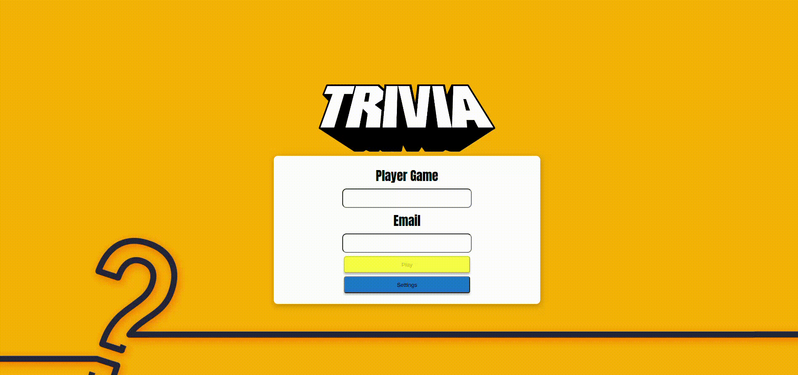

# Bem vindo(a) ao repositório do projeto Trivia!



<br/>

> Neste projeto foi desenvolvido um jogo de perguntas e respostas baseado no jogo Trivia (tipo um show do milhão americano) utilizando React e Redux!


## 🚀 Instalando o repositório

Para instalar o Trivia, clone o repositório:
```
git clone git@github.com:AlinyCruz/project-trivia.git
```
Entre na pasta do repositório que você acabou de clonar:
```
cd project-trivia
```

Instale as dependências e inicialize o projeto. Para isso, use o seguinte comando:
```
npm install
```

## Visualizando o jogo

Para visualizar o jogo Trivia, digite em seu terminal:

```
npm run start  
```

## 🤝 Desenvolvedores

Pessoas que contribuíram para este projeto:

<table>
  <tr>
    <td align="center" style="font-family: Franklin Gothic Medium, sans-serif;">
      <a href="https://github.com/Pinheirop">
        <br>
        <sub>
          <b style="font-size:15px;">
            Paulo Pinheiros</b>
        </sub>
      </a>
    </td>
    <td align="center" style="font-family: Franklin Gothic Medium, sans-serif;">
      <a href="https://github.com/Alvaro-Bettoni">
        <br>
        <sub>
          <b style="font-size:15px;">Alvaro Bettoni</b>
        </sub>
      </a>
    </td>
    <td align="center" style="font-family: Franklin Gothic Medium, sans-serif;">
      <a href="https://github.com/carlosedaraujo">
        <br>
        <sub>
          <b style="font-size:15px;">
            Carlos Eduardo</b>
        </sub>
      </a>
    </td>
    <td align="center" style="font-family: Franklin Gothic Medium, sans-serif;">
      <a href="https://github.com/camilaskaf">
        <br>
        <sub>
          <b style="font-size:15px;">Camila Skaf</b>
        </sub>
      </a>
    </td>
    <td align="center" style="font-family: Franklin Gothic Medium, sans-serif;">
      <a href="https://github.com/AlinyCruz">
        <br>
        <sub>
          <b style="font-size:15px;">
            Aline Cruz</b>
        </sub>
      </a>
    </td>
  </tr>
</table>